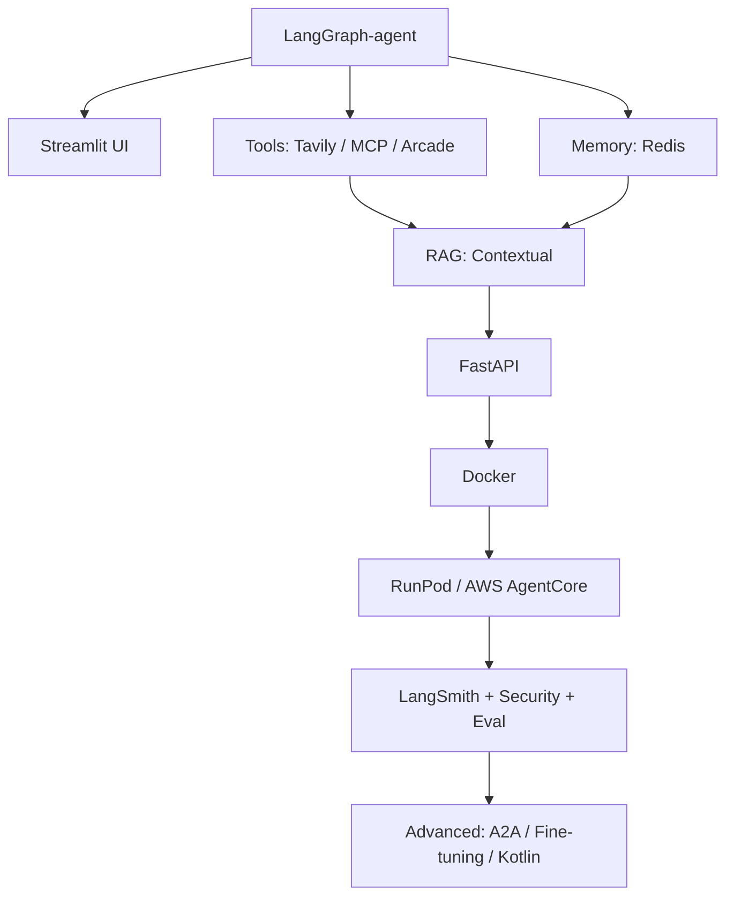

# Learning Path

A recommended reading order for the **Agents Towards Production** tutorials. The repository does not enforce a single sequence — each tutorial folder is self-contained — but following this path builds skills progressively from agent fundamentals to production deployment.

## How to use this guide

- **Follow phases in order** if you are new to production agent development.
- **Jump to a phase** if you already know the earlier topics.
- **Skip vendor-specific tutorials** when you do not use that service (e.g. skip Mem0 if you standardize on Redis).
- **One tutorial at a time** — each folder has its own `requirements.txt` or setup instructions.

## Architecture overview

This path mirrors the production agent stack:

```
Orchestration → Tools & Data → Memory & RAG → API & Deploy → Observability & Security → Advanced
```


---

## Phase 1 — Core agent foundations

Start here. These tutorials teach how agents think, act, and present results.

| Order | Tutorial | Folder | Entry point | Why read it |
|-------|----------|--------|-------------|-------------|
| 1 | Stateful Agent Workflows with LangGraph | [`tutorials/LangGraph-agent`](tutorials/LangGraph-agent) | `langgraph_tutorial.ipynb` | Foundation for stateful, multi-step agents. Required context for Redis memory and several integrations. |
| 2 | Building a Chatbot UI with Streamlit | [`tutorials/agent-with-streamlit-ui`](tutorials/agent-with-streamlit-ui) | `building-chatbot-notebook.ipynb` or `app.py` | Quick UI for demos and local testing. |
| 3 | On-Prem LLM Deployment with Ollama *(optional)* | [`tutorials/on-prem-llm-ollama`](tutorials/on-prem-llm-ollama) | `ollama_tutorial.ipynb` | Run models locally for privacy, cost control, and low latency. |

**Estimated time:** 2–4 hours (without Ollama)

---

## Phase 2 — Tools & external data

Give agents access to the web, APIs, and third-party services.

| Order | Tutorial | Folder | Entry point | Why read it |
|-------|----------|--------|-------------|-------------|
| 4 | Real-Time Web Data (Tavily) | [`tutorials/agent-with-tavily-web-access`](tutorials/agent-with-tavily-web-access) | See sub-path below | Search, scrape, and blend live web data into agent context. |
| 5 | Tool Integration via MCP | [`tutorials/agent-with-mcp`](tutorials/agent-with-mcp) | `mcp-tutorial.ipynb` | Standard protocol for connecting agents to tools and data sources. |
| 6 | Web Data Collection (Bright Data) *(optional)* | [`tutorials/agent-with-brightdata`](tutorials/agent-with-brightdata) | `web_scraping_agent.ipynb` | Enterprise-scale scraping when Tavily is not enough. |
| 7 | Secure Tool Calling (Arcade) | [`tutorials/arcade-secure-tool-calling`](tutorials/arcade-secure-tool-calling) | `multiuser-agent-arcade.ipynb` | OAuth, user isolation, and human-in-the-loop for real tools (Gmail, Slack, etc.). |

### Tavily sub-path (follow in order)

| Step | Notebook | Topic |
|------|----------|-------|
| 4a | `search-extract-crawl.ipynb` | Basics of web access |
| 4b | `web-agent-tutorial.ipynb` | Build a web agent |
| 4c | `hybrid-agent-tutorial.ipynb` | Combine web data with a private knowledge base |

**Estimated time:** 4–8 hours

---

## Phase 3 — Memory & knowledge

Agents that remember users and retrieve domain knowledge.

| Order | Tutorial | Folder | Entry point | Why read it |
|-------|----------|--------|-------------|-------------|
| 8 | Agent Memory with Redis | [`tutorials/agent-memory-with-redis`](tutorials/agent-memory-with-redis) | `agent_memory_tutorial.ipynb` | Short-term and long-term memory with LangGraph. **Requires LangGraph (Phase 1).** |
| 9 | Production RAG (Contextual AI) | [`tutorials/agent-RAG-with-Contextual`](tutorials/agent-RAG-with-Contextual) | See folder README | Enterprise-grade retrieval-augmented generation. |
| 10 | Self-Improving Memory (Mem0) *(pick one)* | [`tutorials/agent-memory-with-mem0`](tutorials/agent-memory-with-mem0) | `mem0_tutorial.ipynb` | Hybrid vector + graph memory that evolves over time. |
| 10 | AI Memory with Cognee *(pick one)* | [`tutorials/ai-memory-with-cognee`](tutorials/ai-memory-with-cognee) | `cognee-ai-memory.ipynb` | Knowledge graphs and unified memory from scattered data. |

**Estimated time:** 3–6 hours

---

## Phase 4 — API & deployment

Turn notebooks into services and ship them.

| Order | Tutorial | Folder | Entry point | Why read it |
|-------|----------|--------|-------------|-------------|
| 11 | Deploying Agents as APIs (FastAPI) | [`tutorials/fastapi-agent`](tutorials/fastapi-agent) | `fastapi-agent-tutorial.ipynb` | Sync and streaming HTTP APIs for agents. |
| 12 | Containerizing Agents with Docker | [`tutorials/docker-intro`](tutorials/docker-intro) | Folder README + `examples/` | Package agents for consistent deployment. |
| 13 | GPU deployment (RunPod) *(pick one)* | [`tutorials/runpod-gpu-deploy`](tutorials/runpod-gpu-deploy) | Folder README | Scalable GPU infrastructure for heavy workloads. |
| 13 | AWS Bedrock AgentCore *(pick one)* | [`tutorials/aws_agentcore`](tutorials/aws_agentcore) | `agentcore_tutorial.ipynb` | Managed agent runtime on AWS. |

**Estimated time:** 4–8 hours

---

## Phase 5 — Production hardening

Observability, security, and quality assurance before real users.

| Order | Tutorial | Folder | Entry point | Why read it |
|-------|----------|--------|-------------|-------------|
| 14 | Agent Tracing (LangSmith) | [`tutorials/tracing-with-langsmith`](tutorials/tracing-with-langsmith) | `langsmith_basics.ipynb` | Debug runs, trace decisions, and monitor performance. |
| 15 | Agent Security (LlamaFirewall) | [`tutorials/agent-security-with-llamafirewall`](tutorials/agent-security-with-llamafirewall) | `input-guardrail.ipynb` → `output-guardrail.ipynb` → `tools-security.ipynb` | Input/output guardrails and tool access control. |
| 16 | Security Evaluation (Apex) | [`tutorials/agent-security-apex`](tutorials/agent-security-apex) | `agent-security-evaluation-tutorial.ipynb` | Prompt injection attacks and automated security testing. |
| 17 | Automated Evaluation (IntellAgent) | [`tutorials/agent-evaluation-intellagent`](tutorials/agent-evaluation-intellagent) | `intellagent-evaluation-tutorial.ipynb` | Behavioral analysis and agent quality metrics. |

**Estimated time:** 4–6 hours

---

## Phase 6 — Advanced topics

Read when your use case needs multi-agent systems, customization, or a non-Python stack.

| Tutorial | Folder | Entry point | When to read |
|----------|--------|-------------|--------------|
| Multi-Agent Communication (A2A) | [`tutorials/a2a`](tutorials/a2a) | `a2a_tutorial.ipynb` | Multiple agents coordinating via a standard protocol |
| Fine-Tuning Agents | [`tutorials/fine-tuning-agents`](tutorials/fine-tuning-agents) | `fine_tuning_agents_guide.ipynb` | Domain expertise, behavior tuning, or cost optimization |
| Kotlin Agents with Koog | [`tutorials/kotlin-agent-with-koog`](tutorials/kotlin-agent-with-koog) | `tutorial.md` → `Step1_HelloAgent.kt` | JVM/Kotlin stack (parallel track, not a Python prerequisite) |

---

## Shortcut paths by goal

### New to agents

1. LangGraph-agent  
2. agent-with-streamlit-ui  
3. agent-with-tavily-web-access (notebooks 4a–4b)

### Chatbot with memory

1. LangGraph-agent  
2. agent-memory-with-redis  
3. agent-with-streamlit-ui  

### Production deployment

1. LangGraph-agent  
2. fastapi-agent  
3. docker-intro  
4. runpod-gpu-deploy **or** aws_agentcore  

### Research agent

1. LangGraph-agent  
2. agent-with-tavily-web-access (all three notebooks)  
3. agent-RAG-with-Contextual  
4. agent-with-mcp  

### Security-first

1. LangGraph-agent  
2. agent-security-with-llamafirewall  
3. agent-security-apex  

### Retail / Ecommerce JD (Omni-Channel Agent)

Full learning + build path for enterprise retail agents (CS, orders, RAG, ERP tools): [RETAIL_OMNI_CHANNEL_AGENT_PATH.md](RETAIL_OMNI_CHANNEL_AGENT_PATH.md)

---

## Visual flow



---

## Setup reminder

Each tutorial is run from its own folder:

```bash
git clone https://github.com/NirDiamant/agents-towards-production.git
cd agents-towards-production

# Example: start with LangGraph
cd tutorials/LangGraph-agent
jupyter notebook langgraph_tutorial.ipynb
```

Some tutorials include a `requirements.txt`; others install dependencies inside the notebook. Check each tutorial's README for dependencies, API keys, and optional cloud accounts.

---

## Full tutorial index

For descriptions of every tutorial without the suggested order, see the [Tutorials section in README.md](README.md#-tutorials).
